# GitHub Profile Trophy (Go 实现)

[](https://github.com/soulteary/github-profile-trophy)


## Languages / 语言 / Sprachen / Lingue / 언어 / 言語

- [English](README.md)
- [简体中文](README.zh.md)
- [Deutsch](README.de.md)
- [Italiano](README.it.md)
- [한국어](README.kr.md)
- [日本語](README.ja.md)

## 🚀 零配置，开箱即用

**无需部署！** 这是 [GitHub Profile Trophy](https://github.com/ryo-ma/github-profile-trophy) 项目的 **100% 兼容 Go 语言实现版本**。你可以将其作为原始服务的**直接替代品**——只需替换 URL，所有现有参数都能完美工作。

### ✨ 为什么选择这个实现？

| 特性 | 原始项目 | 本项目 |
|------|---------|--------|
| **部署方式** | 需要 Vercel/云托管 | ✅ 自托管，完全掌控 |
| **API 兼容性** | - | ✅ 100% 兼容，参数相同 |
| **性能** | Node.js 运行时 | ⚡ Go 运行时，更快更轻量 |
| **速率限制** | 单 Token | 🔄 多 Token 支持 |
| **缓存** | 有限 | 💾 内存 + Redis 支持 |
| **维护** | 依赖服务可用性 | 🛡️ 你掌控服务 |
| **成本** | 可能需要付费托管 | 💰 免费自托管 |

### 🎯 核心优势

- 🎯 **100% API 兼容** - 使用与原始项目完全相同的 URL 参数
- 🚀 **无需部署** - 自托管解决方案，完全掌控你的数据
- ⚡ **高性能** - 使用 Go 语言构建，性能更优，资源占用更低
- 🔄 **多 Token 支持** - 支持多个 GitHub Token，轻松应对更高的 API 速率限制
- 💾 **智能缓存** - 内置内存缓存 + 可选的 Redis 支持，响应更快
- 🎨 **20+ 精美主题** - 支持所有原始主题及更多
- 🛡️ **生产就绪** - 重试机制、错误处理和健壮的架构

### 快速开始 - 只需替换 URL！

如果你已经在使用原始的 GitHub Profile Trophy，当你希望使用自建服务只需替换基础 URL：

**之前（原始项目）：**
```markdown
[](https://github.com/ryo-ma/github-profile-trophy)
```

**之后（本项目）：**
```markdown
[](https://github.com/ryo-ma/github-profile-trophy)
```

**所有参数完全兼容！** 无需修改现有代码。

当然，**更推荐**你参考“在 GitHub Actions 中使用”的方式，将原始请求参数更新到 Action 文件中即可：

```yml
...
- name: Generate trophy card
  uses: soulteary/github-profile-trophy-action@v1.0.0
    with:
      options: 'username=${{ github.repository_owner }}&theme=onedark)](https://github.com/ryo-ma/github-profile-trophy'
      path: .github/assets/trophy.svg
      token: ${{ secrets.GITHUB_TOKEN }}
```

## 功能特性

- ✅ 多等级奖杯卡片生成（SSS, SS, S, AAA, AA, A, B, C）
- ✅ 15+ 奖杯类型（Stars, Commits, Followers, Issues, PRs, Repositories, Reviews 等）
- ✅ 隐藏奖杯（MultiLanguage, AllSuperRank, AncientAccount 等）
- ✅ 20+ 主题支持
- ✅ 可自定义布局（列、行、边距）
- ✅ 按标题和等级过滤
- ✅ 缓存支持（内存 + Redis）
- ✅ 多 token GitHub API 支持，带重试机制

## 📖 使用示例

以下所有示例都使用与原始项目相同的 URL 参数。只需替换基础 URL！

### 基本用法

```markdown
[](https://github.com/ryo-ma/github-profile-trophy)
```


### 使用主题

```markdown
[](https://github.com/ryo-ma/github-profile-trophy)
```


### 按标题过滤

```markdown
[](https://github.com/ryo-ma/github-profile-trophy)
```


### 按等级过滤

```markdown
[](https://github.com/ryo-ma/github-profile-trophy)
```


### 自定义布局

```markdown
[](https://github.com/ryo-ma/github-profile-trophy)
```


> 💡 **提示：** 原始项目的所有 URL 参数在这里都能完美工作。无需修改你现有的 README 代码！

### 在 GitHub Actions 中使用

你可以使用 [github-profile-trophy-action](https://github.com/soulteary/github-profile-trophy-action) 在 CI/CD 流水线中生成奖杯卡片：

```yaml
name: Generate Trophy

on:
  schedule:
    - cron: "0 0 * * *" # 每天午夜运行一次
  workflow_dispatch:

jobs:
  generate:
    runs-on: ubuntu-latest
    
    permissions:
      contents: write
    
    steps:
      - name: Checkout code
        uses: actions/checkout@v4

      - name: Generate trophy card
        uses: soulteary/github-profile-trophy-action@v1.0.0
        with:
          options: 'username=${{ github.repository_owner }}&theme=gruvbox&column=7&margin-w=15&margin-h=15'
          path: .github/assets/trophy.svg
          token: ${{ secrets.GITHUB_TOKEN }}

      - name: Commit trophy card
        run: |
          git config user.name "github-actions[bot]"
          git config user.email "41898282+github-actions[bot]@users.noreply.github.com"
          git add .github/assets/trophy.svg
          git commit -m "Update trophy card" || exit 0
          git push
```

然后在你的 README 中嵌入生成的图片：

```markdown

```

## 🚀 快速开始

### 方式 1：Docker（推荐 - 最简单）

```bash
# 使用 Docker 运行 - 无需安装！
docker run -d \
  -p 8080:8080 \
  -e GITHUB_TOKEN1=your_github_token_here \
  --name github-profile-trophy \
  soulteary/github-profile-trophy:latest
```

完成！你的服务现在运行在 `http://localhost:8080`，可以立即使用所有现有的 URL。

### 方式 2：从源码构建

```bash
# 克隆仓库
git clone https://github.com/soulteary/github-profile-trophy.git
cd github-profile-trophy

# 构建
go build -o github-profile-trophy ./cmd/server

# 运行（设置你的 GitHub token）
GITHUB_TOKEN1=your_github_token_here ./github-profile-trophy
```

### 方式 3：Go 安装

```bash
go install github.com/soulteary/github-profile-trophy/cmd/server@latest
```

### 环境变量

创建 `.env` 文件或设置环境变量：

```bash
# GitHub Personal Access Token (必需)
GITHUB_TOKEN1=your_github_token_here
# 可以配置多个 token 以提高 API 限制
GITHUB_TOKEN2=your_second_token_here

# 服务器端口 (可选，默认 8080)
PORT=8080

# 缓存配置 (可选)
ENABLE_REDIS=false
REDIS_HOST=localhost
REDIS_PORT=6379
REDIS_USERNAME=
REDIS_PASSWORD=

# 生产环境模式 (可选)
NODE_ENV=production
```

> ⚡ **性能提示：** 配置多个 `GITHUB_TOKEN1`、`GITHUB_TOKEN2` 等，可以自动处理更高的 API 速率限制。

## 🎨 可用主题

从 20+ 精美主题中选择！支持原始项目的所有主题。

### 热门主题

<details>
<summary>点击查看所有主题</summary>

### default


### flat


### onedark


### gruvbox


### dracula


### monokai


### chalk


### nord


### alduin


### darkhub


### juicyfresh


### oldie


### buddhism


### radical


### onestar


### discord


### algolia


### gitdimmed


### tokyonight


### matrix


### apprentice


### dark_dimmed


### dark_lover


### kimbie_dark


### aura


</details>

## 📋 API 参数

**100% 兼容原始项目！** 所有参数工作方式完全相同。

| 参数 | 说明 | 默认值 | 示例 |
|------|------|--------|------|
| `username` | GitHub 用户名（必需） | - | `?username=ryo-ma` |
| `theme` | 主题名称 | `"default"` | `&theme=onedark` |
| `title` | 按奖杯标题过滤（逗号分隔，使用 `-` 前缀排除） | 全部 | `&title=Stars,Followers` |
| `rank` | 按等级过滤（逗号分隔，使用 `-` 前缀排除） | 全部 | `&rank=S,AAA` |
| `column` | 最大列数（使用 `-1` 自适应） | `8` | `&column=7` |
| `row` | 最大行数 | `3` | `&row=2` |
| `margin-w` | 奖杯之间的水平边距 | `0` | `&margin-w=15` |
| `margin-h` | 奖杯之间的垂直边距 | `0` | `&margin-h=15` |
| `no-bg` | 透明背景 | `false` | `&no-bg=true` |
| `no-frame` | 隐藏边框 | `false` | `&no-frame=true` |

## 🏆 奖杯类型

### 基础奖杯
- Stars
- Commits
- Followers
- Issues
- Pull Requests
- Repositories
- Reviews

### 隐藏奖杯
- MultiLanguage (10+ 语言)
- AllSuperRank (所有基础奖杯都是 S 级或更高)
- LongTimeUser (10+ 年)
- AncientUser (2010 年之前)
- OGUser (2008 年之前)
- Joined2020 (2020 年加入)
- Organizations (3+ 组织)
- Experience (账户持续时间)

## 排名系统

排名包括：`SECRET`, `SSS`, `SS`, `S`, `AAA`, `AA`, `A`, `B`, `C`, `UNKNOWN`

## 项目结构

```
.
├── cmd/
│   └── server/          # 服务器入口
│       └── main.go
├── internal/
│   ├── api/             # API 处理器
│   ├── cards/           # 卡片渲染逻辑
│   ├── common/          # 通用工具
│   ├── fetchers/        # 数据获取器（GitHub API）
│   ├── themes/          # 主题系统
│   └── trophies/        # 奖杯系统
├── go.mod
└── README.md
```

## ✅ 开发状态

**生产就绪！** 所有核心功能已完成并经过测试。

- ✅ 项目基础结构
- ✅ HTTP 服务器 (Gin 框架)
- ✅ GitHub API 集成 (GraphQL)
- ✅ 重试机制和多 token 支持
- ✅ 缓存处理（内存 + Redis）
- ✅ 主题系统 (20+ 主题)
- ✅ 所有奖杯类型 (15+ 类型)
- ✅ 排名计算
- ✅ 所有 API 端点
- ✅ 100% API 兼容原始项目

## 贡献

欢迎贡献代码！如果你有任何想法或发现问题，请：
1. Fork 本项目
2. 创建你的特性分支
3. 提交你的更改
4. 推送到分支
5. 开启一个 Pull Request

## 许可证

本项目采用 MIT 许可证。
